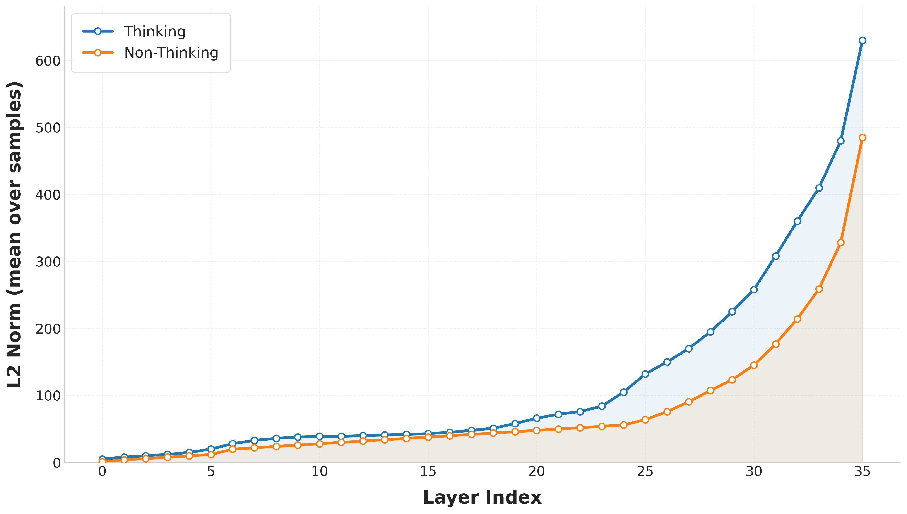
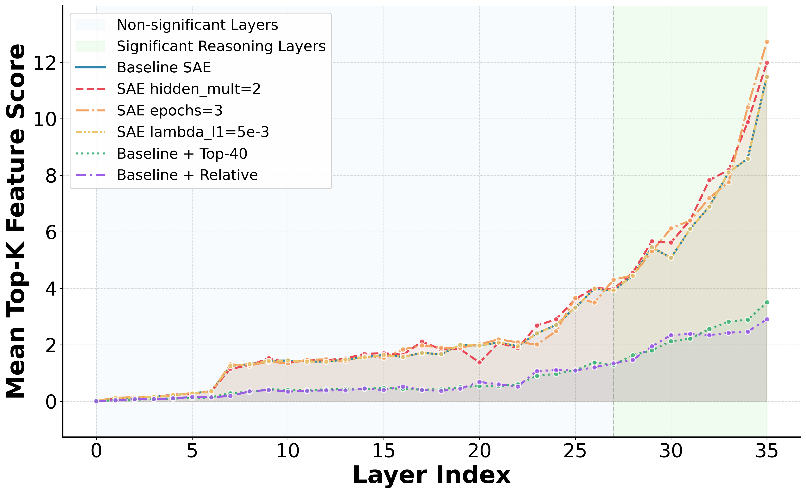
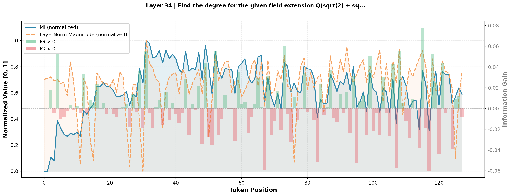
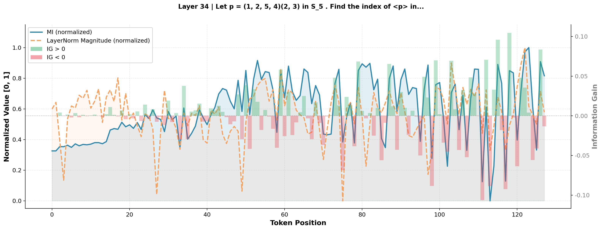

  
   
  <b>Figure 1: L2 Norm comparison across layers for Thinking vs. Non-Thinking responses.</b>.

 
 

  <b>Table 1: Performance comparison with selection methods on Qwen3-4B across reasoning benchmarks.</b>

| Method | aime24 | aime25 | bbh | gpqa_main | gsm8k | gsm-plus | mmlu-pro |
|--------|--------|--------|-----|-----------|-------|----------|----------|
| Base | 60.00 | 56.66 | 84.78 | 48.88 | 95.41 | 79.90 | 67.92 |
| **LRS (Ours)** | **66.67** | **60.00** | 87.20 | **50.22** | 96.20 | **81.04** | **71.41** |
| DeepConf_filter | 56.67 | 53.33 | 88.56 | 47.67 | **96.45** | 79.90 | 65.20 |
| DeepConf_weighted | 63.33 | 60.00 | **89.81** | 48.36 | 95.82 | 80.08 | 61.12 |

 
 

  <b>Table 2: Performance comparison with selection methods on R1-Distilled-LLaMA-8B across reasoning benchmarks.</b>

| Method | aime24 | aime25 | bbh | gpqa_main | gsm8k | gsm-plus | mmlu-pro |
|--------|--------|--------|-----|-----------|-------|----------|----------|
| Base | 40.00 | 33.33 | 70.48 | 50.45 | 88.34 | 67.95 | 39.75 |
| **LRS (Ours)** | 43.33 | **36.67** | 74.14 | **54.68** | **90.82** | **70.57** | **42.31** |
| DeepConf_filter | 43.33 | 33.33 | 76.83 | 53.13 | 88.40 | 68.38 | 39.02 |
| DeepConf_weighted | 43.33 | **36.67** | **80.65** | 50.45 | 89.96 | 68.47 | 39.16 |

 
 

  <b>Table 3: Performance comparison with steering methods on Qwen3-4B across reasoning benchmarks.</b>

| Method | aime24 | aime25 | bbh | gpqa_main | gsm8k | gsm-plus | mmlu-pro |
|--------|--------|--------|-----|-----------|-------|----------|----------|
| Base | 60.00 | 56.66 | 84.78 | 50.22 | 95.41 | 78.90 | 67.92 |
| **TTTS (Ours)** | **66.67** | **60.82** | 87.18 | **51.33** | **96.68** | 79.76 | **71.15** |
| Entropy | 56.67 | 53.33 | 86.87 | 48.06 | 96.38 | 79.48 | 68.55 |
| LogProb | 56.67 | 55.83 | 86.61 | 39.29 | 95.49 | 79.46 | 69.41 |
| SAE | 65.00 | 58.33 | **87.51** | 50.73 | 96.45 | **80.15** | 70.64 |

 
 

  <b>Table 4: Performance comparison with steering methods on R1-Distilled-LLaMA-8B across reasoning benchmarks.</b>

| Method | aime24 | aime25 | bbh | gpqa_main | gsm8k | gsm-plus | mmlu-pro |
|--------|--------|--------|-----|-----------|-------|----------|----------|
| Base | 40.00 | 33.33 | 70.48 | 50.45 | 88.34 | 67.95 | 59.27 |
| **TTTS (Ours)** | 51.67 | **40.00** | 70.90 | **55.13** | 90.40 | 66.43 | **60.67** |
| Entropy | 40.00 | 36.67 | 70.77 | 53.75 | 88.47 | 66.33 | 58.84 |
| LogProb | 43.33 | 33.33 | 71.27 | 53.53 | 88.36 | 65.93 | 59.10 |
| SAE | **53.33** | 38.33 | **70.94** | 54.20 | **90.87** | 65.88 | 59.57 |

 
 

  
   
  <b>Figure 2: Mean Top-K Feature Score across layers for different SAE configurations on Qwen3-4B.</b> We compare the Baseline SAE (hidden_mult=4, epochs=6, lr=1e-3, lambda_l1=1e-3) against variants: reduced capacity (hidden_mult=2), fewer epochs (3), higher sparsity penalty (lambda_l1=5e-3), relative difference ranking ((think-nonthink)/(nothink+ε)), and Top-40 feature dilution. Significant reasoning layers are highlighted in the green shaded region.

 
 

  
   
  <b>Figure 3: Layer 34 analysis of Mutual Information (MI) and Information Gain (IG) over the final 128 tokens(Case 1).</b>

 
 

  
   
  <b>Figure 4: Layer 34 analysis of Mutual Information (MI) and Information Gain (IG) over the final 128 tokens(Case 2).</b>

 
 

  <b>Table 5: Ablation on layer aggregation strategies for ERSS, ALRR, and LRS on Qwen3-4B.</b>

| Method | aime24 | aime25 | bbh | gpqa_main | gsm8k | gsm-plus | mmlu-pro |
|--------|--------|--------|-----|-----------|-------|----------|----------|
| Base | 60.00 | 56.67 | 84.78 | 50.22 | 95.41 | 78.90 | 67.92 |
| **ALRR (default)** | 70.00 | 60.00 | 87.39 | 51.55 | 95.53 | 79.88 | 71.66 |
| Fixed threshold | 23.33 | 16.67 | 85.02 | 25.78 | 95.39 | 78.93 | 69.59 |
| τ=0.5 | 36.67 | 23.33 | 70.56 | 36.43 | 80.64 | 52.69 | 39.88 |
| τ=3 | 70.83 | 60.83 | 86.88 | 52.91 | 95.59 | 79.91 | 72.73 |
| τ=6 | 69.17 | 60.83 | 86.70 | 52.25 | 96.34 | 79.98 | 71.41 |
| Loop-1 | 66.67 | 59.17 | 88.81 | 52.45 | 96.32 | 79.47 | 70.42 |
| Loop-8 | 36.67 | 20.00 | 60.25 | 35.94 | 67.92 | 53.49 | 46.55 |
| **ERSS (default)** | 66.67 | 60.82 | 87.18 | 51.33 | 96.68 | 79.76 | 71.15 |
| Fixed threshold | 16.67 | 10.00 | 84.76 | 26.45 | 95.73 | 78.85 | 70.73 |
| τ=0.5 | 33.33 | 31.67 | 74.92 | 40.33 | 78.41 | 44.32 | 37.45 |
| τ=3 | 66.67 | 61.67 | 86.00 | 50.16 | 96.09 | 79.00 | 70.67 |
| τ=6 | 63.33 | 60.00 | 86.19 | 50.28 | 96.46 | 76.62 | 70.59 |
| **LRS (default)** | 66.67 | 60.00 | 87.20 | 50.22 | 96.20 | 81.04 | 71.41 |
| LRS (peak count) | 70.00 | 57.50 | 85.98 | 52.34 | 95.17 | 78.51 | 70.24 |
| LRS (sum) | 66.67 | 62.50 | 87.57 | 52.17 | 96.80 | 79.27 | 72.08 |
| LRS (middle layers) | 61.67 | 58.33 | 84.76 | 50.14 | 96.18 | 78.96 | 68.42 |

 
 

  <b>Table 6: Ablation on layer aggregation strategies for ERSS, ALRR, and LRS on R1-Distilled-LLaMA-8B. </b>

| Method | aime24 | aime25 | bbh | gpqa_main | gsm8k | gsm-plus | mmlu-pro |
|--------|--------|--------|-----|-----------|-------|----------|----------|
| **LLaMA-8B (Base)** | 40.00 | 33.33 | 70.48 | 50.45 | 88.34 | 67.95 | 59.27 |
| **ALRR (default)** | 47.50 | 36.67 | 72.53 | 52.23 | 90.78 | 68.25 | 60.47 |
| Fixed Threshold | 15.00 | 11.67 | 69.75 | 51.08 | 88.84 | 66.98 | 59.06 |
| $\tau=0.5$ | 23.33 | 23.33 | 34.07 | 23.04 | 81.65 | 36.42 | 34.24 |
| $\tau=3$ | 47.50 | 35.00 | 74.00 | 49.91 | 94.61 | 68.62 | 60.26 |
| $\tau=6$ | 48.33 | 36.67 | 68.78 | 52.76 | 94.49 | 66.61 | 60.36 |
| Loop-1 | 45.00 | 37.5 | 72.78 | 49.64 | 87.26 | 67.60 | 61.12 |
| Loop-8 | 20.83 | 23.33 | 31.79 | 24.08 | 86.36 | 39.87 | 36.76 |
| **ERSS (default)** | 51.67 | 40.00 | 70.90 | 55.13 | 90.40 | 66.43 | 60.67 |
| Fixed Threshold | 6.67 | 16.67 | 71.07 | 51.23 | 87.56 | 68.43 | 58.92 |
| $\tau=0.5$ | 21.67 | 20.00 | 31.85 | 25.24 | 78.86 | 34.95 | 29.56 |
| $\tau=3$ | 50.00 | 41.67 | 71.69 | 52.69 | 90.41 | 65.29 | 61.31 |
| $\tau=6$ | 53.33 | 40.00 | 68.30 | 58.24 | 88.70 | 66.93 | 63.38 |
| **LRS (default)** | 43.33 | 36.67 | 74.14 | 54.68 | 90.82 | 70.57 | 60.31 |
| LRS (peak count) | 47.50 | 38.33 | 69.66 | 55.52 | 90.20 | 67.92 | 59.49 |
| LRS (sum) | 49.16 | 38.33 | 74.65 | 55.35 | 91.74 | 68.64 | 60.46 |
| LRS (middle layers) | 36.67 | 33.33 | 69.36 | 50.54 | 87.64 | 65.95 | 58.62 |

 
 

  <b>Table 7: Results across diverse model families (Phi-4 and Gemma3).</b>

| Model | Method | aime24 | aime25 | bbh | gpqa_main | gsm8k | gsm-plus | mmlu-pro |
|-------|--------|--------|--------|-----|-----------|-------|----------|----------|
| **Phi-4** | Baseline | 13.33 | 13.33 | 84.73 | 48.21 | 94.96 | 77.85 | 69.55 |
| | ALRR | 16.67 | 16.67 | 85.56 | 49.11 | 95.41 | 82.62 | 72.39 |
| | ERSS | 18.33 | 20.00 | 84.67 | 49.55 | 95.03 | 81.79 | 72.17 |
| | LRS | 15.00 | 15.83 | 85.61 | 48.55 | 95.38 | 82.86 | 72.55 |
| **Phi-4-Reasoning** | Baseline | 56.67 | 50.00 | 71.23 | 53.79 | 79.64 | 72.40 | 69.62 |
| | ALRR | 63.33 | 60.00 | 71.69 | 54.69 | 84.21 | 72.57 | 70.59 |
| | ERSS | 66.67 | 53.33 | 73.91 | 56.70 | 88.25 | 75.66 | 74.04 |
| | LRS | 65.00 | 56.67 | 71.27 | 55.47 | 82.68 | 72.45 | 71.83 |
| **Gemma3-4B-it** | Baseline | 10.00 | 13.33 | 69.03 | 26.67 | 87.60 | 70.79 | 42.73 |
| | ALRR | 13.33 | 16.67 | 69.92 | 26.45 | 87.64 | 71.16 | 43.41 |
| | ERSS | 13.33 | 20.00 | 69.67 | 27.23 | 88.78 | 70.80 | 42.98 |
| | LRS | 11.67 | 15.00 | 69.52 | 27.12 | 90.22 | 71.26 | 43.32 |
| **Gemma3-12B-it** | Baseline | 23.33 | 26.67 | 76.74 | 33.26 | 94.01 | 77.80 | 60.59 |
| | ALRR | 28.33 | 30.00 | 77.19 | 36.05 | 93.71 | 77.87 | 61.01 |
| | ERSS | 25.00 | 28.33 | 77.38 | 38.62 | 93.06 | 77.98 | 61.29 |
| | LRS | 26.67 | 28.33 | 76.79 | 36.05 | 93.75 | 77.82 | 60.90 |

 
 

  <b>Table 8: Results on general benchmarks including commonsense reasoning, hallucination detection, knowledge probing, instruction following, and faithfulness-based extraction tasks.</b>

| Model | hellaswag | ifeval | nq_open | pubmed_qa | truthfulqa |
|-------|-----------|--------|---------|-----------|------------|
| **LLaMA3-8B** | 68.25 | 46.28 | **23.24** | **68.20** | 44.19 |
| RR | 67.89 | 47.60 | 21.72 | 65.00 | **44.79** |
| ERSS | 68.20 | **48.80** | 22.30 | 66.40 | 43.94 |
| Rerank | **68.61** | 47.48 | 22.05 | 67.40 | 44.80 |
| **Qwen3-4B** | **80.61** | 49.04 | **28.80** | **68.20** | **46.14** |
| RR | 80.58 | **49.76** | 25.18 | 66.80 | 43.76 |
| ERSS | 80.60 | 49.28 | 25.24 | 67.00 | 44.67 |
| Rerank | 80.59 | 48.92 | 26.78 | 67.80 | 44.30 |

 
 

  
   
  <b>Figure 5: Bad case study illustrating hallucination and false confidence.</b>

 
 

  
   
  <b>Figure 6: Bad case study illustrating overcaution.</b>

